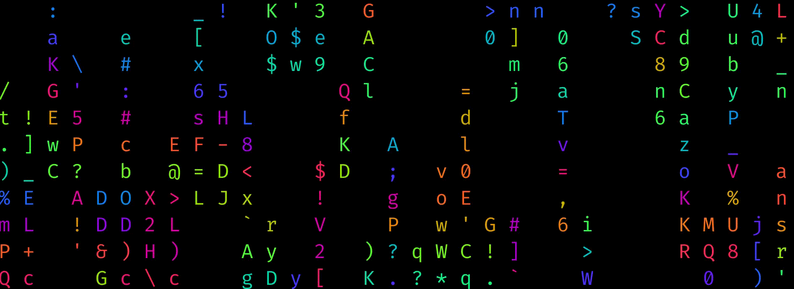

## Hi there, I'm Haisim Yasin 👋

### Software Engineer & AI Specialist | MSc. Data & Knowledge Engineering Student

I am a software engineer with a strong specialization in Artificial Intelligence and scalable backend architecture. I bridge the gap between traditional software development and cutting-edge AI by building intelligent, automated pipelines and enterprise-grade web applications. 

  

### Core Expertise

* **Advanced AI Engineering:** I specialize in building AI agents and chatbots using LangGraph and LangChain. My expertise includes context engineering, advanced prompt engineering, fine-tuning Large Language Models (LLMs), and developing robust AI guardrails that outperform Nemo & Llama benchmarks to block jailbreak attempts.
* **Scalable Backend Architecture:** I develop robust backend services and RESTful APIs utilizing Python, Django REST Framework (DRF), and FastAPI. I also architect complex, asynchronous data pipelines using Celery and queueing systems to handle heavy processing tasks.
* **Full-Stack & Cloud Deployment:** I build modular applications by integrating React TypeScript frontends with scalable backends. I actively manage cloud deployments on platforms like AWS and Hetzner, while establishing automated CI/CD pipelines via GitLab and GitHub Actions to streamline the development lifecycle.
* **Data Engineering & Automation:** I have a solid foundation in data engineering, utilizing tools like PySpark and AWS Glue to transform large datasets, alongside building automated OCR pipelines that drastically reduce manual processing time.

---

### 💻 Tech Stack

**Languages & Frameworks:**
* Python, Django, Django REST Framework (DRF), FastAPI, React

**Artificial Intelligence & Data Science:**
* LangChain/LangGraph, OpenAI/Claude Models, RAG Systems, Vector Databases (pgvector/Chroma), TensorFlow, Scikit-learn, Pandas, Transformers.

**Cloud, DevOps & Databases:**
* AWS (Cognito, Lambda, S3), Docker, CI/CD Pipelines, PostgreSQL, MongoDB, MySQL, Redis

---
**Let's Connect:** [LinkedIn](https://www.linkedin.com/in/haisim-yasin/) 
